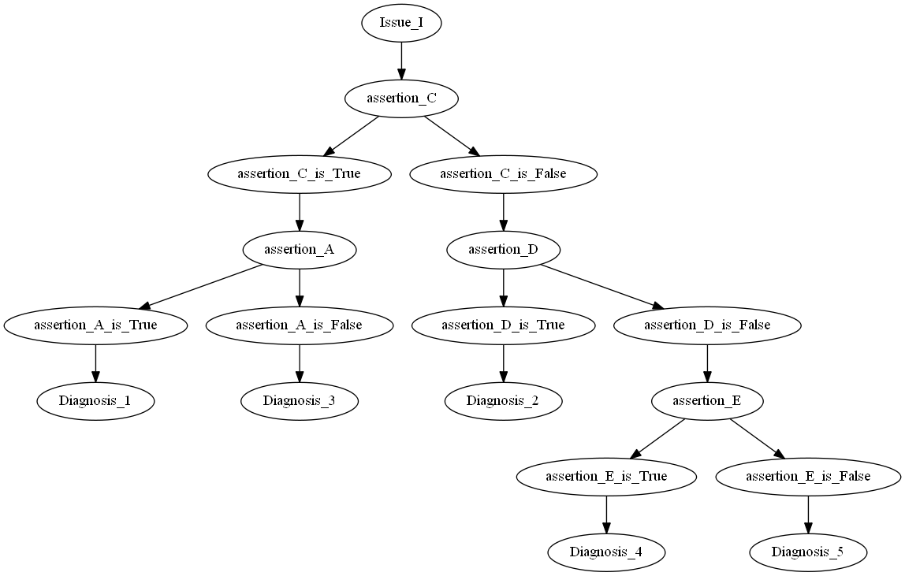

# Osler

Osler is a Python library for creating differential diagnosis decision trees.

## Installation

Use the Setup.py to install osler.

```bash
python setup.py install
```

## Underlying Assumptions

This package allows for creating a differential diagnosis decision tree based on the following assumptions:
* It is possible to test every assertion.

## Features

* Given two diagnoses, determines differential criteria.
* Determines the most efficient decision tree, given multiple diagnoses.

## Features to Add

* Allow for assertions that have a test order constraint.
* Add prevalence to test order selection so that most likely diagnosis can be found in the least number of steps.

## Usage

A minimal example:

```python
from osler.assertion import Assertion
from osler.criterion import Criterion
from osler.diagnosis import Diagnosis
from osler.issue import Issue
from osler.engine import Matrix

#Defining assertions

#            Assertion( Name        ,  Proposition          )
assertionA = Assertion("assertion A", "is assertion A true?")
assertionB = Assertion("assertion B", "is assertion B true?")
assertionC = Assertion("assertion C", "is assertion C true?")
assertionD = Assertion("assertion D", "is assertion D true?")
assertionE = Assertion("assertion E", "is assertion E true?")
assertionX = Assertion("assertion X", "is assertion X true?")
assertionY = Assertion("assertion Y", "is assertion Y true?")

#Defining criteria

#            Criterion(Assertion, Truth Value )
criterionA = Criterion(assertionA, True)
criterionB = Criterion(assertionB, True)
criterionC = Criterion(assertionC, True)
criterionD = Criterion(assertionD, True)
criterionE = Criterion(assertionE, True)

criterionNA = Criterion(assertionA, False)
criterionNB = Criterion(assertionB, False)
criterionNC = Criterion(assertionC, False)
criterionND = Criterion(assertionD, False)
criterionNE = Criterion(assertionE, False)

criterionX = Criterion(assertionX, True)
criterionY = Criterion(assertionY, False)

#Defining diagnoses

#            Diagnosis(Name         ,  Description ,  Remedy   , Set of Criteria                                      , Probability )
diagnosis1 = Diagnosis('Diagnosis 1', 'Diagnosis 1', 'Remedy 1', {criterionA, criterionNB, criterionC, criterionX}, 0.25)
diagnosis2 = Diagnosis('Diagnosis 2', 'Diagnosis 2', 'Remedy 2', {criterionNA, criterionNC, criterionD, criterionY, criterionX}, 0.15)
diagnosis3 = Diagnosis('Diagnosis 3', 'Diagnosis 3', 'Remedy 3', {criterionNA, criterionC, criterionX}, 0.5)
diagnosis4 = Diagnosis('Diagnosis 4', 'Diagnosis 4', 'Remedy 4', {criterionNA, criterionNC, criterionND, criterionE, criterionX}, 0.25)
diagnosis5 = Diagnosis('Diagnosis 5', 'Diagnosis 5', 'Remedy 5', {criterionNA, criterionNC, criterionND, criterionNE, criterionX}, 0.025)

#Defining an issue

#       Issue( Name    ,  Description , Set of Diagnoses )
issue = Issue('Issue I', 'Issue I', {diagnosis1, diagnosis2, diagnosis3, diagnosis4, diagnosis5})

#Building a test tree

matrix = Matrix(issue)
matrix.construct_tree()

matrix.node.to_png("tree.png")
matrix.node.to_svg("tree.svg")
```

This results in the decision tree:


## Contributing
Pull requests are welcome. For major changes, please open an issue first to discuss what you would like to change.

Please make sure to update tests as appropriate.

## License
[MIT](LICENSE)